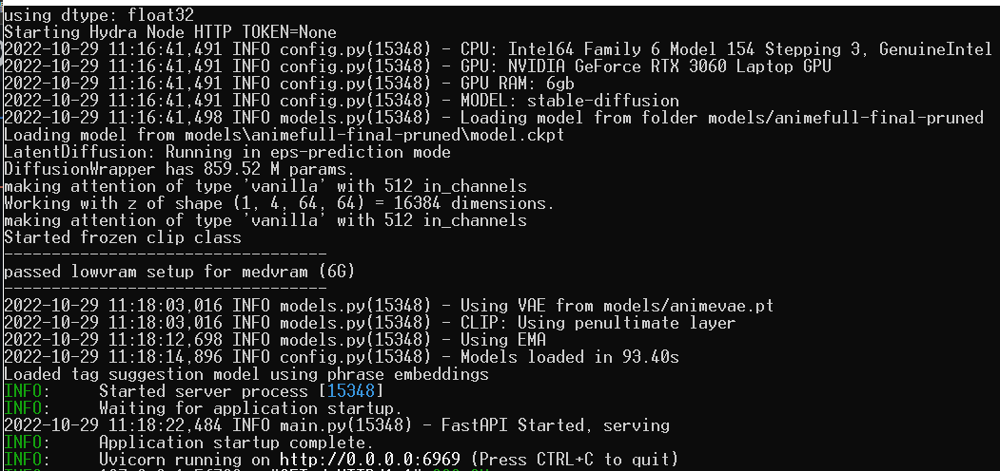
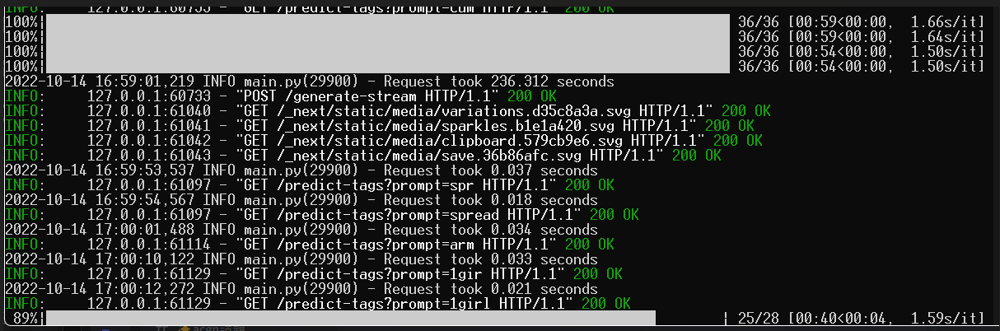
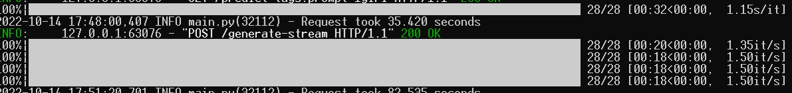

English | [繁體中文](README_TCH.md)
# Tool Recommend:
* [Tag extractor](https://github.com/JingShing/AI-image-tag-extractor)
* [spell generator](https://github.com/JingShing/AI-Drawing-Spell-Generator)
# Warning
This still need 6g or more vram to run. If your gpu isn't powerful enough you may use the [colab ver](https://github.com/null-base/WAIFU-Colab-ver/tree/main/4chan_ver).
# Tutorial Video
You can see [tutorial](https://youtu.be/T09tBeFzYwI) on [youtube](https://youtu.be/T09tBeFzYwI) by clicking img below

# How to use
* ## Activate any bat script you prefer.

* ## After the 0.0.0.0:6969 showed up. Like image below.

* ## Enter the http://127.0.0.1:6969/ in any browser.

# ImageAI-4chan-lowvram-ver
A low vram ver for installing Imageai 4chan leaked ver.
## How you get the low vram ver AI
* [google cloud](https://drive.google.com/file/d/1ydm2JRJf8w9G0_KBWLJNQ7Yj3KCIN1XL/view?usp=sharing)
* [Mega](https://mega.nz/file/OBMF0D6Q#HGmNIB8ZmRJVZ2mWJ5aN2cm4iatdxV7Oqej0GfOHI-o)

It has all module you need and it can run faster and need less vram than original 4chan ver. You can use 1660 or 3060 to run this AI. It only takes 6g vram to run.

## Original efficiency

## Low vram version efficiency

